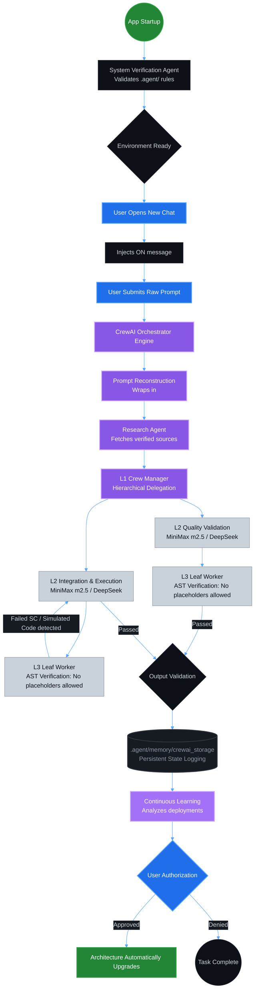

# 🌌 Antigravity 3-Tier Multi-Agent Architecture (Powered by CrewAI)

> **A Production-Grade, Self-Healing, and Continuously Learning Execution Engine**
> Version 2.0.0 | Target: Google Gemini 3.1 Pro Preview, OpenAI, MiniMax, DeepSeek | Platform: Darwin arm64

---

## 🎯 Purpose & Description

### Description
The Antigravity 3-Tier Multi-Agent Architecture is a deterministically structured, highly optimized orchestration system operating natively within the Antigravity IDE (and via standalone CLI). Upgraded in v2.0.0 to leverage **CrewAI**, it utilizes a rigorous, specialized hierarchy of agents (Prompt Reconstruction, Research, Orchestration, Sub-Agents, and Leaf Workers) bound by strict operational constraints to autonomously decompose and fulfill complex user requests. 

It explicitly orchestrates complex file management, script execution, and document formatting by integrating a **1:1 Requirement-to-Instruction mapping Protocol**, driving toward maximum practical execution integrity across the entire project pipeline.

### Purpose
The fundamental objective of this architecture is to maximize execution accuracy through deterministic pipelines and programmatic self-correction mechanisms. By enforcing a single source of truth, an absolute zero-tolerance policy for simulated code (enforced by strict AST code verification scaffolds), and a continuous self-learning protocol, the system aims to attain the highest statistically probable rate of user requirements fulfillment. Its ultimate operational mandate is producing genuinely verified, production-grade assets and software that align with rigorous enterprise engineering standards.

---

## 🚀 CrewAI Integration & Model Matrix

The architecture maps CrewAI's Agent/Task/Crew execution model onto the hierarchical pipeline. It incorporates a robust **Primary → Fallback LLM routing mechanism** with soft-failure detection to ensure system resilience.

| Tier | Role | Primary Model | Fallback Model | Thinking Effort |
|------|------|--------------|----------------|-----------------|
| **Orchestration** | Manager/Router | Gemini 3.1 Pro Preview | GPT-5.2-Codex | High → xHigh |
| **Level 1** | Senior/Analytical | GPT-5.2-Codex | MiniMax m2.5 | Medium |
| **Level 2** | Execution/Worker | MiniMax m2.5 | DeepSeek v3.2 | Low |

---

## 📦 Installation & Setup

To securely deploy the architecture into your local Antigravity IDE environment or standalone workspace:

```bash
# 1. Clone the repository
git clone https://github.com/Victordtesla24/3-tier-multi-agent-architecture.git
cd 3-tier-multi-agent-architecture

# 2. Install dependencies via uv (Required for CrewAI)
uv sync --all-extras

# 3. Setup API Keys
cp .env.template .env
# Edit .env and supply your GOOGLE_API_KEY, OPENAI_API_KEY, MINIMAX_API_KEY, MINIMAX_BASE_URL, DEEPSEEK_BASE_URL, etc.

# 4. Make the integration script executable
chmod +x scripts/integrate_crewai.sh

# 5. Run the CrewAI integration & setup
./scripts/integrate_crewai.sh
```

### What `integrate_crewai.sh` Does Automatically:
- **Dependency Installation**: Uses `uv` to install `crewai`, `litellm`, and related orchestration libraries into a highly optimized Python virtual environment.
- **Environment Validation**: Checks for required keys (`GOOGLE_API_KEY` and `OPENAI_API_KEY`) within `.env`.
- **Directory Setup**: Provisions `src/engine/` and execution script paths.

---

## ⚙️ Standalone Python CLI Mode

For non-IDE environments, Docker containers, or CI/CD pipelines, you can run the orchestration engine directly using the `uv` environment:

```bash
# Run a prompt through the full 3-tier CrewAI pipeline
# NOTE: Always specify --workspace pointing to a writable directory.
export PYTHONPATH=src
uv run python src/orchestrator/antigravity-cli.py \
  --workspace /tmp/antigravity_workspace \
  --prompt "Your objective here" \
  --verbose
```

> **Important:** The `--workspace` flag must point to a directory you own and have write access to. The pipeline writes structured telemetry to `<workspace>/.agent/memory/execution_log.json`.

```bash
# Run the full test suite (33/33 Tests Passing ✅)
make test-pytest
```

---

## 📊 System Architecture & Data Flow

The architecture operates in a strict, sequential hierarchy using CrewAI's `Process.hierarchical` execution, ensuring your prompt is reconstructed, researched, completely executed without simulated placeholders, and logged for continuous learning.



---

## 🛠 Usage Guidelines

The system is designed to trigger autonomously. You do not need to invoke specific rules.
1. **Submit your prompt**: Describe your objective.
2. **Watch the orchestration in action**: The CrewAI Orchestrator will convert your raw input into a highly optimized, deterministic system prompt and delegate it through its Crew of specialized agents.
3. **Review Continuous Learning Proposals**: Once a task finishes successfully, the Continuous Learning Agent evaluates the result. If it discovers pattern optimizations, it will **HALT** and prompt you with:
   - **WHAT**: The proposed change.
   - **WHY**: The data-backed reasoning.
   - **HOW**: The expected benefits.
   > **Note:** Explicitly type "Approved" or exactly match the requested authorization constraint to allow the system to apply upgrades.

---

## 🔍 Maintenance & Verification

### How to functionally verify the architecture status:

Use the Antigravity Terminal to confirm the environment configurations. It should match the blueprint exactly:

```bash
# 1. Check if the directories exist
ls -la .agent/rules .agent/workflows .agent/tmp .agent/memory

# 2. Check the Agent Manager
antigravity status agents
# Expected Output should include:
# - system-verification-agent
# - internet-research-agent
# - l1-orchestration
# - l2-sub-agent
# - l3-leaf-worker
# - continuous-learning-agent

# 3. Verify the main Workflow
antigravity workflow list
# Should display '3-tier-orchestration.md'
```

---

## ⚠️ Troubleshooting Guide

If the architecture fails to execute cleanly, refer to this diagnostic flowchart:

```mermaid
graph TD
    classDef query fill:#1f6feb,stroke:#58a6ff,stroke-width:2px,color:#fff;
    classDef action fill:#238636,stroke:#2ea043,stroke-width:2px,color:#fff;
    classDef warning fill:#9e6a03,stroke:#d29922,stroke-width:2px,color:#fff;

    Q1{"CrewAI Initialization Errors?"}:::query
    Q1 -- YES --> A1[Run './scripts/integrate_crewai.sh' & 'uv sync --all-extras']:::action
    Q1 -- NO --> Q2{"Are API Keys missing?"}:::query

    Q2 -- YES --> A2[Check '.env' file against '.env.template'. \nGemini and OpenAI keys are mandatory.]:::action
    Q2 -- NO --> Q3{"Are agents failing AST Verification?"}:::query

    Q3 -- YES --> A3[Ensure L3 agents are not outputting 'pass' or 'TODO'.\nThe orchestrator rejects placeholder logic.]:::warning
    Q3 -- NO --> Q4{"Is FallbackLLM exhausting connection retries?"}:::query

    Q4 -- YES --> A4[Verify your custom L2/L3 proxy base URLs \n(e.g. MINIMAX_BASE_URL) are reachable.]:::warning
    Q4 -- NO --> OPT[System is fully operational]:::action
```

### Common Faults & Remediations
- **Issue**: Missing CrewAI dependencies or version conflicts.
  - **Remediation**: Run `uv sync --all-extras`. We recommend a Python 3.12+ virtual environment to guarantee compatible pre-built wheels for underlying Rust extensions (`pydantic-core`, `tokenizers`, `tiktoken`).
- **Issue**: AST Verification Error `Verification failed: detected banned lexical marker 'TODO'` or `AST detected empty implementation (pass)`.
  - **Remediation**: Re-run the objective with stricter constraints against boilerplate code. The system pipeline fundamentally rejects simulated logic prior to completion.
- **Issue**: FallbackLLM exhaustion.
  - **Remediation**: This indicates both the primary and fallback LLMs for a particular tier failed simultaneously (e.g., API outage or bad API Key). Verify the network proxy and base URLs in your `.env`.
