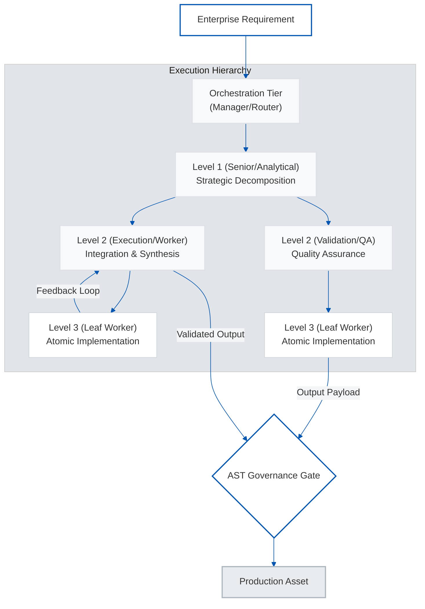
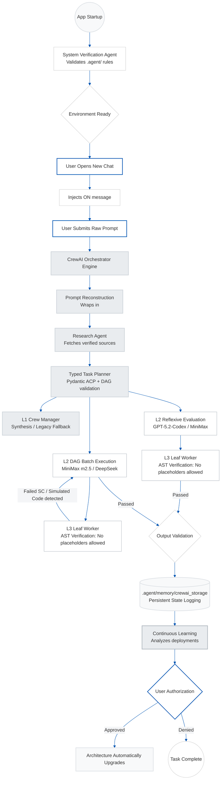
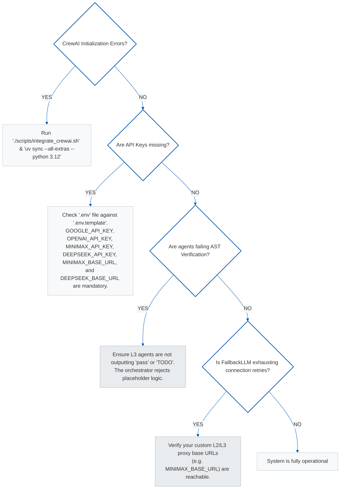

# Antigravity 3-Tier Multi-Agent Architecture


## 1. Executive Summary

The Antigravity 3-Tier Multi-Agent Architecture represents a paradigm shift in autonomous, production-grade software engineering and enterprise orchestration. Designed explicitly for organizations operating at scale, this framework leverages advanced large language models (LLMs) coordinated through a deterministic, self-healing pipeline. By integrating the CrewAI orchestration layer with a proprietary tri-level agent hierarchy, the architecture ensures that complex requirements are decomposed, executed, and validated with programmatic precision.

At its core, the solution addresses the persistent challenge of execution reliability within generative AI applications. Traditional single-agent systems frequently falter under the weight of complex, multi-step engineering tasks, often yielding syntactically correct but functionally simulated outputs. The Antigravity framework resolves this through a stringent 1:1 Requirement-to-Instruction mapping protocol, a typed internal task graph with dependency validation and parallel batch scheduling, and a mathematically rigorous multi-language verification gateway that parses Python and performs syntax checks for JavaScript, TypeScript, and shell fenced blocks. This zero-tolerance policy for simulated code or unverified placeholders guarantees that the output generated is inherently deployment-ready.

The key value proposition lies in the convergence of speed, scale, and operational certainty. By transforming the software development lifecycle from a human-bottlenecked process into an autonomous, scalable engine, enterprises can immediately capture unprecedented time-to-market advantages. The architecture not only accelerates development but structurally remediates technical debt in real-time through continuous self-learning mechanisms, aligning directly with the core tenets of modern enterprise digital transformation.

## 2. Strategic Business Value

The adoption of an autonomous multi-agent orchestration framework functions as a critical competitive differentiator in the modern digital economy. Leading advisory firms, including McKinsey and BCG, have consistently highlighted that mature AI adoption transcends basic automation to fundamentally reinvent the software delivery supply chain. The Antigravity architecture embodies this maturity vector.

**Core Enterprise Benefits & Market Alignment:**

*   **Accelerated Time-to-Market:** By automating complex software engineering workflows, organizations can shrink development cycles from weeks to hours. Research suggests early enterprise adopters of advanced multi-agent coding frameworks experience efficiency gains ranging from 30% to 50% in initial feature delivery.
*   **Structural Quality Assurance:** The mandatory AST validation framework prevents unverified, simulated, or defective logic from penetrating the codebase. This drastically reduces the downstream cost of technical debt resolution and post-deployment incident mitigation.
*   **Optimal Resource Allocation:** The platform reallocates senior engineering bandwidth from routine implementation to high-value strategic architecture. Human capital is preserved for complex problem-solving rather than exhaustive boilerplate generation and debugging loops.
*   **Resilience via Model Redundancy:** By operating a tiered, heterogeneous model matrix (e.g., Gemini, OpenAI, MiniMax, DeepSeek), the system prevents vendor lock-in and mitigates single-point-of-failure API disruptions, ensuring absolute operational continuity.

**Before and After: The Antigravity Transformation**

| Operational Phase | Traditional Engineering Paradigm | Antigravity Autonomous Orchestration | Enterprise Impact |
| :--- | :--- | :--- | :--- |
| **Requirements Parsing** | Ambiguous, fragmented translation by distributed teams | Deterministic 1:1 mapping via LLM reconstruction protocols | Eradicates misalignment and accelerates kickoff |
| **Execution & Validation** | Human review loops; susceptible to context fatigue | Continuous AST-gated validation; automated self-checking | Guarantees code integrity; prevents regressions |
| **Fault Remediation** | Reactive patching; high mean-time-to-resolution (MTTR) | Proactive fallback routing and automated self-healing | Ensures near-zero downtime and operational resilience |
| **Knowledge Retention** | Siloed institutional knowledge | Centralized, localized continuous learning feedback loops | Defends intellectual property; institutionalizes best practices |

## 3. High-Level Architecture Overview

The system operates across a strictly regulated, three-tiered hierarchical topology. This structure governs the flow of requirements, the delegation of specialized sub-tasks, and the final assembly of production assets, eliminating the context-window exhaustion and hallucination risks inherent to flat LLM architectures.




**Architectural Stratification:**

1.  **Orchestration Tier (Manager):** Acting as the primary routing and cognitive hub, this level interprets raw corporate requirements, normalizes constraints, and dictates hierarchical delegation. It relies on frontier models (e.g., Gemini 3.1 Pro Preview) deployed with highest reasoning capacity constraints.
2.  **Level 1 (Senior/Analytical):** Functions as the lead architect for specific, segmented workflows. It coordinates the research, manages the project state, and maintains total alignment with enterprise architectural blueprints, ensuring a Single Source of Truth parameterization.
3.  **Level 2 & 3 (Execution, Quality & Leaf Operations):** The functional execution layers responsible for writing, parsing, and validating the software. Level 3 operates under strict authorization to produce only genuine, atomic, and publication-ready assets.

## 4. Implementation & Deployment

The deployment framework is optimized for minimal friction and rapid integration into existing corporate infrastructure. Designed to thrive both natively on local high-performance hardware (e.g., Apple ARM architecture) and across distributed CI/CD cloud pipelines, the architecture relies on standardized Python containerization technologies.

**Enterprise Deployment Lifecycle:**

1.  **Repository Acquisition:** Clone the foundational framework into a secure organizational workspace.
2.  **Containerized Dependency Resolution:** Execute the `uv` packet manager integration. This enforces deterministic, stateful dependency lockdowns across the environment, resolving system-level binaries efficiently.
3.  **Credential & Proxy Configuration:** Securely provision API keys, corporate proxy gateways, and inference endpoints via centralized environmental templates, establishing connectivity with the enterprise's preferred commercial LLMs.
4.  **Autonomous Core Bootstrapping:** Execute the included initialization scripts, enabling the framework to auto-verify its internal registry and provision critical caching storage.

For cloud or hybrid infrastructures, the complete execution engine can be enveloped within Docker containers, exposing the standalone Python CLI to existing pipeline runners (e.g., Jenkins, GitLab CI) for unbounded scalability.

## 5. Risk Management & Governance

Deploying autonomous systems within the enterprise requires stringent safeguards against non-deterministic behavior, compliance violations, and execution failures. The Antigravity framework mitigates these operational risks through structural, embedded governance.

**Core Governance Mechanisms:**

*   **Abstract Syntax Tree (AST) and Syntax Verification Gates:** A strict zero-tolerance policy for simulated code or unverified placeholders. Before output is serialized or merged, Python code undergoes AST parsing, while JavaScript, TypeScript, and shell fenced blocks undergo language-appropriate syntax validation. Non-compliant, hallucinated, or malformed logic is systematically rejected, and the execution is autonomously routed back for remediation.
*   **Multi-Model Redundancy & Soft-Failure Detection:** The proprietary routing mechanism perpetually monitors primary API streams. Upon connection exhaustion, rate-limiting, or structural refusal, the proxy seamlessly cascades traffic to pre-configured localized or secondary LLM instances. This guarantees business continuity.
*   **Deterministic Workspaces:** All telemetry, code generation, and memory matrices are forcibly constrained to isolated, authorized directories. This structural containment prevents unauthorized system permutation and guarantees data provenance for subsequent auditing.
*   **Human-In-The-Loop (HITL) Upgrade Authorizations:** While the system operates autonomously during routine tasks, all structural, macro-level architectural refinements detected by the Continuous Learning Agent are immediately paused, requiring explicit human authorization prior to instantiation.

## 6. Roadmap & Continuous Improvement

The architecture is designed contrary to static frameworks; it is inherently a self-modifying, persistently learning entity. Value accrual effectively compounds as the system engages with increasingly complex enterprise objectives.

**Strategic Evolution Horizons:**

*   **Automated Intelligence Harvesting:** The Continuous Learning module analyzes structured pipeline-completion telemetry, clusters recurring failure modes, tracks stage latency, and proposes WHAT/WHY/HOW operational enhancements from observed execution data.
*   **Ecosystem Expansion:** Current support centers on core commercial and robust open-weights models. The roadmap dictates a frictionless expansion to incorporate hyper-localized, on-premises corporate models for strict data sovereignty compliance.
*   **Advanced Threat Modeling:** Incorporating native Level 2 specialized sub-agents exclusively dedicated to preemptive security fuzzing and vulnerability scanning prior to any repository commit.

## 7. Conclusion & Next Steps

The Antigravity 3-Tier Multi-Agent Architecture is a decisive leap toward total software engineering automation. By imposing rigid determinism upon inherently probabilistic generative AI models, it offers Fortune 500 enterprises an immediate, scalable mechanism to drastically increase code throughput, elevate software quality, and permanently alter their operational cost basis.

**Immediate Next Steps for Enterprise Adoption:**

1.  **Executive Sandbox Deployment:** Provision a secure, sandboxed hardware or cloud environment to test the framework against historical, non-critical backlog assignments.
2.  **Model Matrix Configuration:** Establish corporate accounts and API gateways for the required multi-provider LLM models, optimizing cost and geographic considerations.
3.  **Strategic Pipeline Integration Analysis:** Map the existing manual CI/CD touchpoints to the autonomous lifecycle steps authorized by the orchestrator, identifying primary areas for immediate overhead reduction.

---

## 8. Technical Integration & Installation Guide

For engineering leadership directing the immediate deployment or local evaluation of the Antigravity architecture, the following streamlined protocols dictate the physical integration of the framework.

### 8.1 Core System Initialization


To securely deploy the architecture into your local Antigravity IDE environment or standalone workspace:

```bash
# 1. Clone the repository
git clone https://github.com/Victordtesla24/3-tier-multi-agent-architecture.git
cd 3-tier-multi-agent-architecture

# 2. Install dependencies via uv (Required for CrewAI)
uv sync --all-extras --python 3.12

# 3. Setup API Keys
cp .env.template .env
# Edit .env and supply your GOOGLE_API_KEY, OPENAI_API_KEY, MINIMAX_API_KEY, DEEPSEEK_API_KEY, MINIMAX_BASE_URL, DEEPSEEK_BASE_URL, etc.
# Optionally set CREWAI_STORAGE_DIR (defaults to <workspace>/.agent/memory/crewai_storage).

# 4. Make the integration script executable
chmod +x scripts/integrate_crewai.sh

# 5. Run the CrewAI integration & setup
./scripts/integrate_crewai.sh
```

### What `integrate_crewai.sh` Does Automatically:
- **Dependency Installation**: Uses `uv` to install `crewai`, `litellm`, and related orchestration libraries into a highly optimized Python virtual environment.
- **Environment Validation**: Checks for required keys (`GOOGLE_API_KEY` and `OPENAI_API_KEY`) within `.env`.
- **Directory Setup**: Provisions `src/engine/` and execution script paths.

---

## ⚙️ Standalone Python CLI Mode

For non-IDE environments, Docker containers, or CI/CD pipelines, you can run the orchestration engine directly using the `uv` environment:

```bash
# Run a prompt through the full 3-tier CrewAI pipeline
# NOTE: --workspace is optional. If omitted, defaults to ANTIGRAVITY_WORKSPACE_DIR env var
#       or <project_root>/workspaces/cli-default. Specify it explicitly to control where
#       pipeline artifacts and telemetry are written.
export PYTHONPATH=src
uv run python src/orchestrator/antigravity-cli.py \
  --workspace /tmp/antigravity_workspace \
  --prompt "Your objective here" \
  --verbose
```

> **Important:** The `--workspace` flag is **optional**. When specified, it must point to a directory you own and have write access to. When omitted, the CLI resolves the workspace in this order: (1) `ANTIGRAVITY_WORKSPACE_DIR` environment variable, (2) `<project_root>/workspaces/cli-default`. The pipeline writes structured telemetry to `<workspace>/.agent/memory/execution_log.json`.

```bash
# Run the full test suite
make test-pytest

# Run the benchmark harness
make benchmark
# Results are saved to docs/benchmarks/latest_results.json and docs/benchmarks/latest_results.md
```

---

## 📊 System Architecture & Data Flow

The architecture keeps CrewAI as the canonical runtime, but the execution layer now hardens the main path with a typed task graph, dependency-aware DAG batching, reflexive worker QA, and a controlled fallback to the legacy hierarchical Crew when planning cannot start safely.



## 🛠 Usage Guidelines

The system is designed to trigger autonomously. You do not need to invoke specific rules.
1. **Submit your prompt**: Describe your objective.
2. **Watch the orchestration in action**: The CrewAI Orchestrator will convert your raw input into a highly optimized, deterministic system prompt and delegate it through its Crew of specialized agents.
3. **Review Continuous Learning Proposals**: Once a task finishes successfully, the Continuous Learning Agent evaluates the result using structured pipeline telemetry, failure-mode clustering, and stage-duration analysis. If it discovers pattern optimizations, it will **HALT** and prompt you with:
   - **WHAT**: The proposed change.
   - **WHY**: The data-backed reasoning.
   - **HOW**: The expected benefits.
   > **Note:** Explicitly type "Approved" or exactly match the requested authorization constraint to allow the system to apply upgrades.

### Hardened Runtime Details

The primary `execute()` path now performs:
1. typed task planning with dependency and cycle validation
2. internal DAG execution in parallelizable batches
3. reflexive worker evaluation and bounded retry before task results enter shared state
4. synthesis of validated task outputs into the final deliverable
5. automatic fallback to the legacy hierarchical Crew only when the task graph cannot begin safely

The CLI and orchestration API remain stable. They now expose additive runtime metadata including `execution_mode`, `plan_id`, `task_count`, `parallel_batch_count`, `worker_retry_count`, and `task_failure_count`.

### Inspectable Workspace Artifacts

The runtime writes shared artifacts under the active workspace so each run can be inspected after execution:
- `.agent/tmp/`
  - `reconstructed_prompt.md`
  - `research-context.md`
  - `final_output.md`
- `.agent/memory/`
  - `execution_log.json`
  - `crewai_storage/`
  - `improvement-notes.md` when continuous-learning proposals are approved

These directories are safe to inspect during debugging, benchmarking, and post-run validation.

---

## 📊 Benchmarks

The architecture includes a reproducible benchmark harness under `benchmarks/run_benchmark.py`. It measures pipeline latency and success rate using deterministic fixtures.

```bash
make benchmark
```

Results are persisted as versioned artifacts:
- **JSON**: `docs/benchmarks/latest_results.json`
- **Markdown**: `docs/benchmarks/latest_results.md`

> See the [benchmark harness source](benchmarks/run_benchmark.py) for methodology details.

---

## 🧪 Experimental Modules

The `src/experimental/` directory contains non-canonical orchestrator implementations retained for reference:

- **LangGraph Orchestrator** (`src/experimental/langgraph/`): The initial prototype, superseded by the CrewAI-backed orchestrator. See its [README](src/experimental/langgraph/README.md) for details.

> These modules are **not used** by the CLI, Docker, or CI.

---

## 🔍 Maintenance & Verification

### How to functionally verify the architecture status:

Use your terminal to confirm the environment is correctly configured:

```bash
# 1. Check if the core directories exist
ls -la .agent/rules .agent/workflows .agent/tmp .agent/memory

# 2. Verify all agent rule files are present
ls .agent/rules/
# Expected output:
# - system-verification-agent.md
# - internet-research-agent.md
# - l1-orchestration.md
# - l2-sub-agent.md
# - l3-leaf-worker.md
# - continuous-learning-agent.md

# 3. Verify the main workflow
cat .agent/workflows/3-tier-orchestration.md
# Should display the 3-tier orchestration workflow steps

# 4. Run the test suite to confirm the architecture is functional
make test-pytest
```

---

## ⚠️ Troubleshooting Guide

If the architecture fails to execute cleanly, refer to this diagnostic flowchart:



### Common Faults & Remediations
- **Issue**: Missing CrewAI dependencies or version conflicts.
  - **Remediation**: Run `uv sync --all-extras --python 3.12`. This enforces a compatible interpreter for pre-built wheels used by Rust-backed dependencies (`pydantic-core`, `tokenizers`, `tiktoken`).
- **Issue**: AST Verification Error `Verification failed: detected banned lexical marker 'TODO'` or `AST detected empty implementation (pass)`.
  - **Remediation**: Re-run the objective with stricter constraints against boilerplate code. The system pipeline fundamentally rejects simulated logic prior to completion.
- **Issue**: FallbackLLM exhaustion.
  - **Remediation**: This indicates both the primary and fallback LLMs for a particular tier failed simultaneously (e.g., API outage or bad API Key). Verify the network proxy and base URLs in your `.env`.
