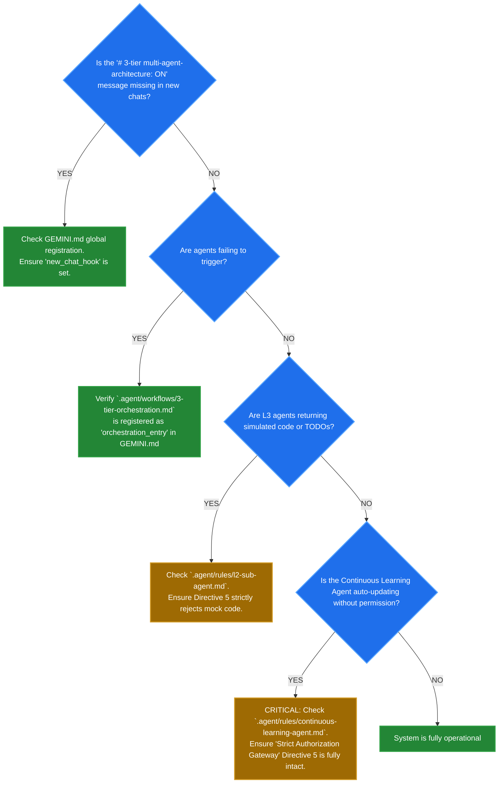

# 🌌 Antigravity 3-Tier Multi-Agent Architecture

> **A Production-Grade, Self-Healing, and Continuously Learning Execution Engine**
> Version 1.1 | Target: Google Gemini 3.1 Pro Preview | Platform: Darwin arm64 (MacBook Pro M5)

---

## 🎯 Purpose & Description

### Description
The Antigravity 3-Tier Multi-Agent Architecture is a deterministically structured, highly optimized orchestration system operating natively within the Antigravity IDE (and via standalone CLI). It leverages a rigorous, specialized hierarchy of agents (Prompt Reconstruction, Research, Orchestration, Sub-Agents, and Leaf Workers) bound by strict operational constraints to autonomously decompose and fulfill complex user requests. It explicitly orchestrates complex file management, script execution, and document formatting by integrating a **1:1 Requirement-to-Instruction mapping Protocol**, driving toward maximum practical execution integrity across the entire project pipeline.

### Purpose
The fundamental objective of this architecture is to maximize execution accuracy through deterministic pipelines and programmatic self-correction mechanisms. By enforcing a single source of truth, an absolute zero-tolerance policy for simulated code (enforced by code verification scaffolds), and a continuous self-learning protocol, the system aims to attain the highest statistically probable rate of user requirements fulfillment. Its ultimate operational mandate is producing genuinely verified, production-grade assets and software that align with rigorous enterprise engineering standards.

---

## 📦 Installation & Setup

To securely deploy the architecture into your local Antigravity IDE environment, natively clone the repository and autonomously execute the setup script. This script executes entirely as-is without requiring manual code modifications.

```bash
# 1. Clone the repository into your desired project directory
git clone https://github.com/Victordtesla24/3-tier-multi-agent-architecture.git
cd 3-tier-multi-agent-architecture

# 2. Make the installation script executable
chmod +x install.sh

# 3. Run the autonomous installer
./install.sh
```

### What `install.sh` Does Automatically:
- **Detects Antigravity IDE**: Validates that your MacBook Pro M5 environment natively supports the IDE.
- **Validates & Recreates Files**: Scans `.agent/` and `docs/` folders natively. IF files DO NOT EXIST or were maliciously deleted, it actively **RECREATES THEM** using the secure repository index as the hardened source of truth.
- **Re-verifies Implementation**: Automatically re-checks, re-validates, and securely hardwires the architecture execution hooks securely into your core Antigravity engine configuration.
- **Confirms Status Message**: Explicitly guarantees the exact `# 3-tier multi-agent-architecture: ON` status message is definitively printed on every new chat conversation.

---

## 📊 System Architecture & Data Flow

The architecture operates in a strict, sequential hierarchy ensuring your prompt is reconstructed, researched, completely executed without simulated placeholders, and logged for continuous learning.

```mermaid
%%{init: {'theme': 'base', 'themeVariables': { 'primaryColor': '#0d1117', 'primaryTextColor': '#c9d1d9', 'primaryBorderColor': '#30363d', 'lineColor': '#58a6ff', 'secondaryColor': '#161b22', 'tertiaryColor': '#21262d'}}}%%

flowchart TD
    %% Define Styles
    classDef user fill:#1f6feb,stroke:#58a6ff,stroke-width:2px,color:#fff;
    classDef init fill:#238636,stroke:#2ea043,stroke-width:2px,color:#fff;
    classDef core fill:#8957e5,stroke:#d2a8ff,stroke-width:2px,color:#fff;
    classDef worker fill:#c9d1d9,stroke:#8b949e,stroke-width:1px,color:#0d1117;
    classDef storage fill:#161b22,stroke:#30363d,stroke-width:2px,color:#8b949e;
    classDef review fill:#a371f7,stroke:#d2a8ff,stroke-width:2px,color:#fff;

    %% Global Initialization
    START((App Startup)):::init --> VERIFY[System Verification Agent\nValidates .agent/ rules & auto-heals missing components]
    VERIFY --> READY{Environment Ready}

    %% User Interaction
    NEW_CHAT[User Opens New Chat]:::user --> MSG[Injects: '# 3-tier multi-agent-architecture: ON']
    READY --> NEW_CHAT
    MSG --> PROMPT[User Submits Raw Prompt]:::user

    %% Pipeline Execution
    PROMPT --> RECONSTRUCT[Prompt Reconstruction Protocol\nWraps in <input_data> tag]:::core
    RECONSTRUCT --> RESEARCH[Internet Research Agent\nFetches verified sources & constraints]:::core
    RESEARCH --> L1[L1 Orchestration Agent\nDecomposes objectives & enforces single-source-of-truth]:::core
    
    %% L2 / L3 Delegation
    L1 --> L2_A[L2 Sub-Agent: Task A]:::worker
    L1 --> L2_B[L2 Sub-Agent: Task B]:::worker
    L2_A --> L3_A[L3 Leaf Worker\nGenuine, publication-ready code only.\nNO placeholders allowed.]:::worker
    L2_B --> L3_B[L3 Leaf Worker\nGenuine, publication-ready code only.\nNO placeholders allowed.]:::worker

    %% Feedback loop
    L3_A -- Failed SC / Simulated Code detected --> L2_A
    L3_B -- Passed --> VALIDATION{Output Validation}
    L2_A -- Passed --> VALIDATION

    %% Memory and Post-processing
    VALIDATION --> MEMORY[(.agent/memory/\nPersistent State Logging)]:::storage
    MEMORY --> LEARNING[Continuous Learning & Self-Correction Agent\nAnalyzes deployments]:::review
    LEARNING --> APPROVAL{User Authorization\nWHAT / WHY / HOW}:::user
    APPROVAL -- "Approved" --> UPDATE[Architecture Automatically Upgrades]:::init
    APPROVAL -- "Denied" --> END((Task Complete))

    %% Strict Sub-graphing for clarity
    subgraph Execution Pipeline
        RECONSTRUCT
        RESEARCH
        L1
        L2_A
        L2_B
        L3_A
        L3_B
        VALIDATION
    end
```



---

## 🛠 Usage Guidelines

The system is designed to trigger autonomously. You do not need to invoke specific rules.
1. **Submit your prompt**: Describe your objective.
2. **Watch the reconstruction**: The Prompt Reconstruction Protocol will convert your raw input into a highly optimized, deterministic system prompt.
3. **Review Continuous Learning Proposals**: Once a task finishes successfully, the Continuous Learning Agent evaluates the result. If it discovers pattern optimizations, it will **HALT** and prompt you with:
   - **WHAT**: The proposed change.
   - **WHY**: The data-backed reasoning.
   - **HOW**: The expected benefits.
   > **Note:** Explicitly type "Approved" or exactly match the requested authorization constraint to allow the system to apply upgrades.

---

## 🔍 Maintenance & Verification
### How to functionally verify the architecture status:

Use the Antigravity Terminal to confirm the environment configurations. It should match the blueprint exactly:

```bash
# 1. Check if the directories exist
ls -la .agent/rules .agent/workflows .agent/tmp .agent/memory

# 2. Check the Agent Manager
antigravity status agents
# Expected Output should include:
# - system-verification-agent (always_on / new_chat)
# - internet-research-agent
# - l1-orchestration
# - l2-sub-agent
# - l3-leaf-worker
# - continuous-learning-agent

# 3. Verify the main Workflow
antigravity workflow list
# Should display '3-tier-orchestration.md'
```

---

## ⚠️ Troubleshooting Guide

If the architecture fails to execute cleanly, refer to this diagnostic flowchart:



### Common Faults & Remediations
- **Issue**: Missing directories or agent configuration files.
  - **Remediation**: Restart the Antigravity App. The `System Verification Agent` is bound to `startup` and will natively reconstruct missing architecture files exactly to match `docs/architecture/multi-agent-3-level-architecture.md`.
- **Issue**: L2 looping infinitely on L3 failure.
  - **Remediation**: The L2 agent has a maximum retry of 3 iterations. Review the prompt parameters; the constraints may be impossible or highly conflicting.
- **Issue**: Duplicate files proliferating in the project.
  - **Remediation**: Ensure the L1 Orchestrator directive #9 ("STRICTLY enforce single source of truth") is present in `.agent/rules/l1-orchestration.md`. The L1 agent oversees consolidation.
