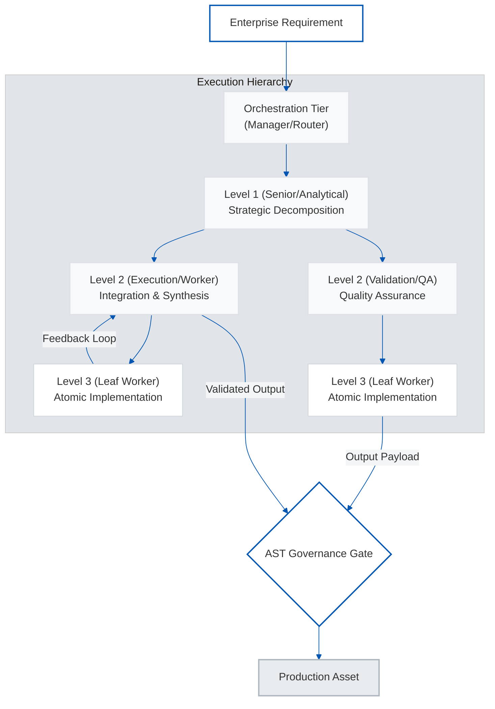
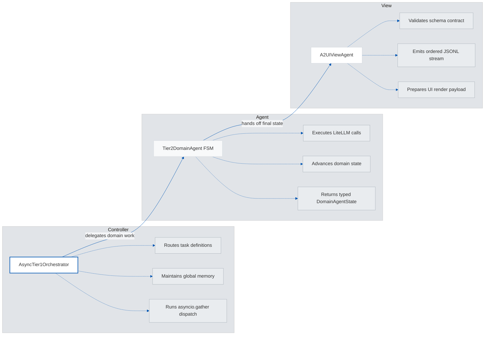
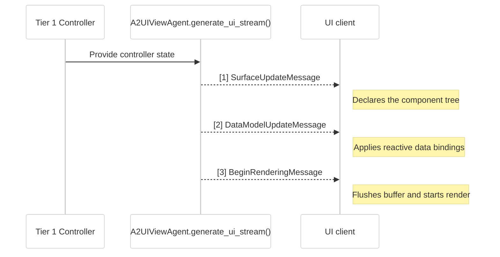
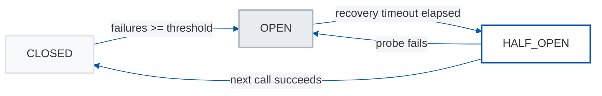
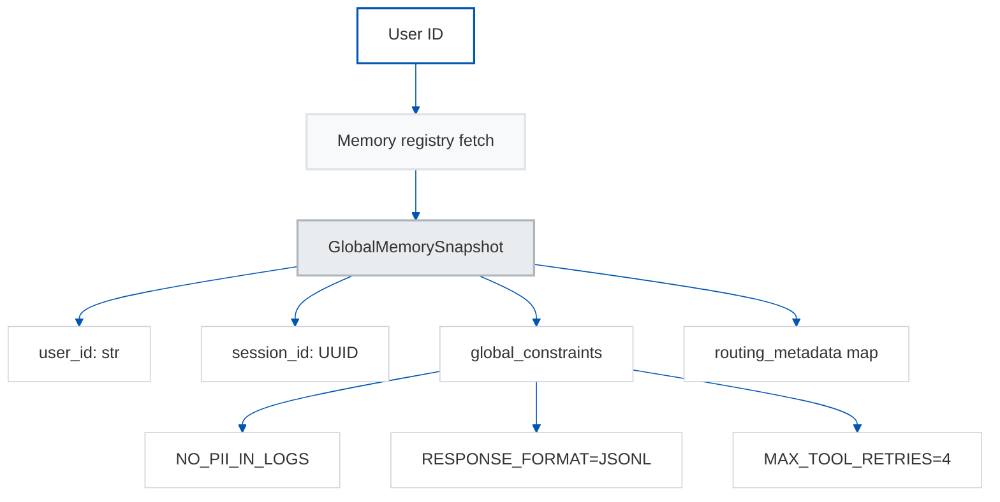
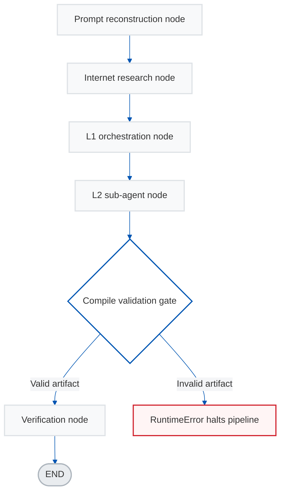
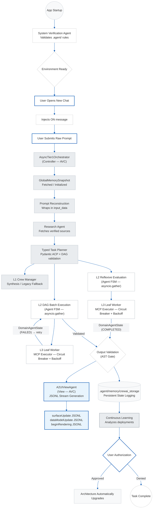
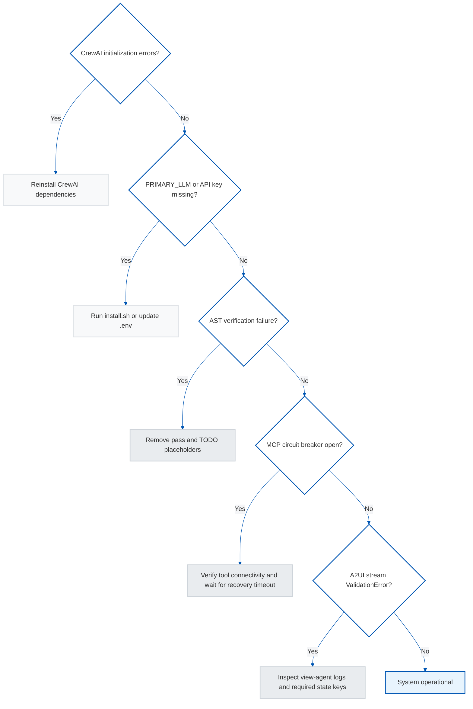

# Antigravity 3-Tier Multi-Agent Architecture


## 1. Executive Summary

The Antigravity 3-Tier Multi-Agent Architecture represents a paradigm shift in autonomous, production-grade software engineering and enterprise orchestration. Designed explicitly for organizations operating at scale, this framework leverages advanced large language models (LLMs) coordinated through a deterministic, self-healing pipeline. By integrating the CrewAI orchestration layer with a proprietary tri-level agent hierarchy, the architecture ensures that complex requirements are decomposed, executed, and validated with programmatic precision.

At its core, the solution addresses the persistent challenge of execution reliability within generative AI applications. Traditional single-agent systems frequently falter under the weight of complex, multi-step engineering tasks, often yielding syntactically correct but functionally simulated outputs. The Antigravity framework resolves this through a stringent 1:1 Requirement-to-Instruction mapping protocol, a typed internal task graph with dependency validation and parallel batch scheduling, and a mathematically rigorous multi-language verification gateway that parses Python and performs syntax checks for JavaScript, TypeScript, and shell fenced blocks. This zero-tolerance policy for simulated code or unverified placeholders guarantees that the output generated is inherently deployment-ready.

The key value proposition lies in the convergence of speed, scale, and operational certainty. By transforming the software development lifecycle from a human-bottlenecked process into an autonomous, scalable engine, enterprises can immediately capture unprecedented time-to-market advantages. The architecture not only accelerates development but structurally remediates technical debt in real-time through continuous self-learning mechanisms, aligning directly with the core tenets of modern enterprise digital transformation.

---

## 2. Strategic Business Value

The adoption of an autonomous multi-agent orchestration framework functions as a critical competitive differentiator in the modern digital economy. Leading advisory firms, including McKinsey and BCG, have consistently highlighted that mature AI adoption transcends basic automation to fundamentally reinvent the software delivery supply chain. The Antigravity architecture embodies this maturity vector.

**Core Enterprise Benefits & Market Alignment:**

*   **Accelerated Time-to-Market:** By automating complex software engineering workflows, organizations can shrink development cycles from weeks to hours. Research suggests early enterprise adopters of advanced multi-agent coding frameworks experience efficiency gains ranging from 30% to 50% in initial feature delivery.
*   **Structural Quality Assurance:** The mandatory AST validation framework prevents unverified, simulated, or defective logic from penetrating the codebase. This drastically reduces the downstream cost of technical debt resolution and post-deployment incident mitigation.
*   **Optimal Resource Allocation:** The platform reallocates senior engineering bandwidth from routine implementation to high-value strategic architecture. Human capital is preserved for complex problem-solving rather than exhaustive boilerplate generation and debugging loops.
*   **Resilience via Model Redundancy:** By operating a tiered, heterogeneous model matrix (for example Gemini, OpenAI, DeepSeek, and Ollama-hosted Qwen variants), the system prevents vendor lock-in and mitigates single-point-of-failure API disruptions, ensuring absolute operational continuity.

**Before and After: The Antigravity Transformation**

| Operational Phase | Traditional Engineering Paradigm | Antigravity Autonomous Orchestration | Enterprise Impact |
| :--- | :--- | :--- | :--- |
| **Requirements Parsing** | Ambiguous, fragmented translation by distributed teams | Deterministic 1:1 mapping via LLM reconstruction protocols | Eradicates misalignment and accelerates kickoff |
| **Execution & Validation** | Human review loops; susceptible to context fatigue | Continuous AST-gated validation; automated self-checking | Guarantees code integrity; prevents regressions |
| **Fault Remediation** | Reactive patching; high mean-time-to-resolution (MTTR) | Proactive fallback routing and automated self-healing | Ensures near-zero downtime and operational resilience |
| **Knowledge Retention** | Siloed institutional knowledge | Centralized, localized continuous learning feedback loops | Defends intellectual property; institutionalizes best practices |

---

## 3. High-Level Architecture Overview

The system operates across a strictly regulated, three-tiered hierarchical topology. This structure governs the flow of requirements, the delegation of specialized sub-tasks, and the final assembly of production assets, eliminating the context-window exhaustion and hallucination risks inherent to flat LLM architectures.



**Architectural Stratification:**

1.  **Orchestration Tier (Manager):** Acting as the primary routing and cognitive hub, this level interprets raw corporate requirements, normalizes constraints, and dictates hierarchical delegation. It relies on frontier models (e.g., OpenAI GPT-5.2 or Google Gemini 3 Pro Preview) deployed with highest reasoning capacity constraints.
2.  **Level 1 (Senior/Analytical):** Functions as the lead architect for specific, segmented workflows. It coordinates the research, manages the project state, and maintains total alignment with enterprise architectural blueprints, ensuring a Single Source of Truth parameterization.
3.  **Level 2 & 3 (Execution, Quality & Leaf Operations):** The functional execution layers responsible for writing, parsing, and validating the software. Level 3 operates under strict authorization to produce only genuine, atomic, and publication-ready assets.

---

## 4. Agent-View-Controller (AVC) Architecture

The Antigravity framework decouples concerns across three distinct roles aligned with the **Agent-View-Controller (AVC)** pattern — a specialized adaptation of MVC for autonomous multi-agent systems.



### 4.1 Role Decoupling

| Role | Module | Responsibility |
| :--- | :--- | :--- |
| **Controller** | `src/orchestrator/tier1_manager.py` | Routes task definitions to Domain Agents asynchronously; manages the `GlobalMemorySnapshot` registry; invokes `asyncio.gather()` for parallel swarm execution |
| **Agent** | `src/orchestrator/tier1_manager.py` (`Tier2DomainAgent`) | Finite-State Machine (FSM) executing domain-specific LLM directives and returning a strictly typed `DomainAgentState` payload |
| **View** | `src/view/a2ui_protocol.py` (`A2UIViewAgent`) | Transforms the Controller's final state into a strictly validated, declarative **A2UI JSONL stream** for UI rendering |

### 4.2 Key Data Models

-   **`GlobalMemorySnapshot`** — Injected into Tier 2 agents at instantiation to provide cross-cutting constraints (`NO_PII_IN_LOGS`, `RESPONSE_FORMAT=JSONL`, `MAX_TOOL_RETRIES=4`) without polluting each agent's context window.
-   **`DomainAgentState`** — Pydantic-validated state payload returned by each FSM agent. Fields include `agent_id`, `domain_type`, `status` (constrained to `INIT|RUNNING|COMPLETED|FAILED`), `structured_output`, and `confidence_score`. This eliminates semantic drift caused by unstructured LLM summarization.

---

## 5. A2UI Protocol — Streaming Middleware & JSONL Specification

The **A2UI v0.8 protocol** (`src/view/a2ui_protocol.py`) is the View layer's typed streaming middleware. It enforces a strict data contract between the orchestration backend and the UI rendering client, preventing XSS/RCE vectors caused by unvalidated LLM payloads reaching the frontend.

### 5.1 Message Types

Every stream is a sequence of newline-delimited JSON (JSONL) lines, each conforming to one of three strictly typed Pydantic message schemas:

| Message Type | Pydantic Model | Purpose |
| :--- | :--- | :--- |
| `surfaceUpdate` | `SurfaceUpdateMessage` | Declares or updates the full UI component tree for a named surface |
| `dataModelUpdate` | `DataModelUpdateMessage` | Propagates reactive state changes via JSON Pointer path-based key-value pairs |
| `beginRendering` | `BeginRenderingMessage` | Instructs the client to flush its render buffer and execute the final render pass |

### 5.2 Streaming Flow



### 5.3 Protocol Enforcement

The `_validate_and_serialize()` method performs a **double-validation round-trip** — it re-instantiates the Pydantic model from its own dump before serialization. This catches mutations applied after initial construction that could otherwise violate the protocol contract. Any `ValidationError` results in the stream being aborted with a `RuntimeError`, ensuring clients never receive a partially formed or malformed payload.

---

## 6. Fault-Tolerant MCP Utility Execution (Tier 3)

Tier 3 execution is governed by `src/utility/mcp_executor.py`. This module implements two complementary reliability patterns for interacting with external Model Context Protocol (MCP) servers: **Exponential Backoff** and a **Stateful Circuit Breaker**.

### 6.1 Exponential Backoff

The retry loop implements the standard exponential progression:

```
E(t) = min(E_max, E_base × 2ⁿ)
```

Where `E_base = 1.0s`, `E_max = 16.0s`, and `n` is the zero-indexed attempt number. This prevents thundering-herd conditions against rate-limited (HTTP 429) or temporarily unavailable MCP endpoints.

| Attempt | Delay |
| :--- | :--- |
| 1 (initial) | 0s |
| 2 | 1s |
| 3 | 2s |
| 4 (final) | 4s → fail |

### 6.2 Circuit Breaker States

The `MCPUtilityExecutor` maintains a stateful circuit with three discrete states:



-   **CLOSED**: Normal operation. Failures are counted.
-   **OPEN**: All calls are immediately rejected (`CircuitBreakerOpenException`) to prevent cascading failures.
-   **HALF_OPEN**: A single probe call is permitted after the recovery timeout expires. Success resets to CLOSED; failure re-opens the circuit.

### 6.3 Configuration Defaults

| Parameter | Default | Description |
| :--- | :--- | :--- |
| `failure_threshold` | 3 | Consecutive failures required to trip the circuit |
| `recovery_timeout_seconds` | 30 | Seconds the circuit remains OPEN before testing recovery |
| `max_retries` | 4 | Maximum execution attempts with backoff |

---

## 7. Asynchronous Tier 1 Orchestration

The `AsyncTier1Orchestrator` (`src/orchestrator/tier1_manager.py`) fundamentally resolves the synchronous blocking bottleneck inherent in serial agent pipelines.

### 7.1 Concurrent Swarm Execution

```python
# Tier 2 Domain Agents are instantiated and scheduled concurrently
results = await asyncio.gather(*execution_coroutines, return_exceptions=False)
```

The orchestrator maps each incoming task definition to a `Tier2DomainAgent`, queues their `execute_fsm_playbook()` coroutines, and fires them all simultaneously via `asyncio.gather()`. This eliminates cumulative LLM API latency in multi-domain task sets — a swarm of N agents completes in `max(latency_i)` time rather than `sum(latency_i)`.

### 7.2 Deterministic Global Memory

The `GlobalMemorySnapshot` registry ensures agents share a read-only, cross-cutting constraint snapshot without fragmentation:



Memory is initialized once per `user_id` and reused across all agents in the same orchestration cycle. This prevents the semantic drift that arises when agents independently summarize state into unstructured strings.

### 7.3 Non-Blocking Architecture Guarantee

-   **All** Tier 2 and Tier 3 agent calls are implemented as `async def` coroutines.
-   I/O-bound blocking operations (e.g., SQLite introspection in `fetch_database_schema`) are off-loaded to thread pools via `asyncio.to_thread()`.
-   The orchestration API surface (`src/engine/orchestration_api.py`) inherits this async model throughout.

---

## 8. Experimental: LangGraph Graph-Based State Machine Orchestration

The `src/experimental/langgraph/` module contains a parallel, graph-based orchestration prototype using **LangGraph** (`StateGraph`). This is retained as a research reference alongside the canonical CrewAI implementation.

### 8.1 Architecture

The LangGraph pipeline models the multi-agent workflow as a **directed acyclic graph (DAG)** of deterministic node functions:



### 8.2 Typed State (`ArchitectState`)

All inter-node data is carried via the `ArchitectState` Pydantic model (`src/experimental/langgraph/models.py`). This ensures strict type contracts between graph transitions — no unstructured dictionary passing.

### 8.3 L2 Artifact Verification

The `l2_sub_agent_node` calls a live LLM (`gpt-5.4` by default in the current runtime) to generate Python implementation artifacts and then calls Python's built-in `compile()` to verify syntactic integrity before storing results in `L2ValidationResult`. An empty or syntactically invalid artifact immediately raises a `RuntimeError`, halting the pipeline.

### 8.4 Usage

```bash
# Run the LangGraph experimental pipeline standalone
export OPENAI_API_KEY=your_key_here
export PYTHONPATH=src
python src/experimental/langgraph/langgraph_orchestrator.py
```

> **Note:** The LangGraph module is **not invoked** by the CLI, Docker, or CI pipelines. See its dedicated [README](src/experimental/langgraph/README.md) for further context.

---

## 9. Implementation & Deployment

The deployment framework is optimized for minimal friction and rapid integration into existing corporate infrastructure. Designed to thrive both natively on local high-performance hardware (e.g., Apple ARM architecture) and across distributed CI/CD cloud pipelines, the architecture relies on standardized Python containerization technologies.

**Enterprise Deployment Lifecycle:**

1.  **Repository Acquisition:** Clone the foundational framework into a secure organizational workspace.
2.  **Automated Installer:** Run `install.sh` for guided, interactive setup including dynamic LLM model selection.
3.  **Containerized Dependency Resolution:** Execute the `uv` packet manager integration. This enforces deterministic, stateful dependency lockdowns across the environment.
4.  **Credential & Proxy Configuration:** Securely provision API keys and inference endpoints via the installer or manually via `.env`.
5.  **Autonomous Core Bootstrapping:** Execute the included initialization scripts, enabling the framework to auto-verify its internal registry.

For cloud or hybrid infrastructures, the complete execution engine can be enveloped within Docker containers, exposing the standalone Python CLI to existing pipeline runners (e.g., Jenkins, GitLab CI) for unbounded scalability.

---

## 10. Risk Management & Governance

Deploying autonomous systems within the enterprise requires stringent safeguards against non-deterministic behavior, compliance violations, and execution failures. The Antigravity framework mitigates these operational risks through structural, embedded governance.

**Core Governance Mechanisms:**

*   **Abstract Syntax Tree (AST) and Syntax Verification Gates:** A strict zero-tolerance policy for simulated code or unverified placeholders. Before output is serialized or merged, Python code undergoes AST parsing, while JavaScript, TypeScript, and shell fenced blocks undergo language-appropriate syntax validation.
*   **Multi-Model Redundancy & Soft-Failure Detection:** The proprietary routing mechanism perpetually monitors primary API streams. Upon connection exhaustion, rate-limiting, or structural refusal, the proxy seamlessly cascades traffic to pre-configured localized or secondary LLM instances.
*   **Deterministic Workspaces:** All telemetry, code generation, and memory matrices are forcibly constrained to isolated, authorized directories.
*   **Human-In-The-Loop (HITL) Upgrade Authorizations:** All structural, macro-level architectural refinements detected by the Continuous Learning Agent are immediately paused, requiring explicit human authorization prior to instantiation.
*   **MCP Circuit Breaker Protection:** Tier 3 external tool calls are wrapped in a stateful circuit breaker, preventing cascading failures from propagating up the agent hierarchy.

---

## 11. Roadmap & Continuous Improvement

*   **Automated Intelligence Harvesting:** The Continuous Learning module analyzes structured pipeline-completion telemetry, clusters recurring failure modes, tracks stage latency, and proposes WHAT/WHY/HOW operational enhancements.
*   **Ecosystem Expansion:** Current support centers on core commercial and robust open-weights models. The roadmap dictates a frictionless expansion to incorporate hyper-localized, on-premises corporate models for strict data sovereignty compliance.
*   **Advanced Threat Modeling:** Incorporating native Level 2 specialized sub-agents exclusively dedicated to preemptive security fuzzing and vulnerability scanning prior to any repository commit.

---

## 12. Technical Integration & Installation Guide

### 12.1 Quick Installation (Recommended)

The `install.sh` script provides an interactive, guided installation experience. It dynamically presents a menu of the latest production-ready models from Google AI, OpenAI, DeepSeek, and local Ollama and securely captures your API credentials.

```bash
# 1. Clone the repository
git clone https://github.com/Victordtesla24/3-tier-multi-agent-architecture.git
cd 3-tier-multi-agent-architecture

# 2. Run the interactive installer
chmod +x install.sh
./install.sh
```

The installer will:
1. Verify the Antigravity IDE environment.
2. Validate and self-heal missing architecture files.
3. **Interactively present a grouped menu of the latest supported OpenAI, Google AI, DeepSeek, and local Ollama models.**
4. Securely prompt for the corresponding API key only when the selected provider needs one.
5. Automatically write `PRIMARY_LLM`, `ORCHESTRATION_MODEL`, default `L1_MODEL` / `L2_MODEL` / `L3_MODEL`, swarm settings, and the active provider configuration into your `.env` file.
6. Install all Python dependencies via `uv`.
7. Register the architecture with the global Antigravity configuration.

### 12.2 Manual Installation

```bash
# 1. Clone the repository
git clone https://github.com/Victordtesla24/3-tier-multi-agent-architecture.git
cd 3-tier-multi-agent-architecture

# 2. Install dependencies via uv
uv sync --all-extras --python 3.12

# 3. Setup API keys and the tiered model matrix
cp .env.template .env
# Edit .env.
# Tier vars override PRIMARY_LLM. PRIMARY_LLM remains the orchestration fallback selector for older installs.
# Example (default matrix):
#   PRIMARY_LLM=openai/gpt-5.4
#   ORCHESTRATION_MODEL=openai/gpt-5.4
#   L1_MODEL=gemini/gemini-3.1-pro-preview
#   L2_MODEL=ollama/qwen3:8b
#   L3_MODEL=ollama/qwen2.5-coder:7b
#   L2_AGENT_SWARMS=2
#   L3_AGENT_SWARMS=3
#   OPENAI_API_KEY=your_openai_api_key_here
#   GOOGLE_API_KEY=your_google_api_key_here
#   DEEPSEEK_API_KEY=your_deepseek_api_key_here
#   DEEPSEEK_BASE_URL=https://api.deepseek.com/v1
#   OLLAMA_BASE_URL=http://127.0.0.1:11434

# 4. Run the CrewAI integration & setup
chmod +x scripts/integrate_crewai.sh
./scripts/integrate_crewai.sh

# 5. Audit the active tier matrix and every configured provider credential
PYTHONPATH=src uv run python scripts/validate_runtime_env.py \
  --workspace . \
  --project-root . \
  --live \
  --probe-configured-providers \
  --report-path docs/reports/validation_report.json
```

> `--live` probes the active primary tiers selected by `ORCHESTRATION_MODEL`, `L1_MODEL`, `L2_MODEL`, and `L3_MODEL`. `--probe-configured-providers` separately probes every configured provider surface found in `.env`, including inactive providers and accepted aliases such as `GEMINI_API_KEY`. The command exits non-zero if any configured provider probe fails.

### 12.3 Supported Primary LLM Values for `PRIMARY_LLM`

| Provider | `PRIMARY_LLM` Value | API Key Variable |
| :--- | :--- | :--- |
| OpenAI GPT-5.4 | `openai/gpt-5.4` | `OPENAI_API_KEY` |
| OpenAI GPT-5.2 Codex | `openai/gpt-5.2-codex` | `OPENAI_API_KEY` |
| Google Gemini 3.1 Pro Preview | `gemini/gemini-3.1-pro-preview` | `GOOGLE_API_KEY` |
| DeepSeek Chat | `deepseek/deepseek-chat` | `DEEPSEEK_API_KEY` |
| Ollama Qwen 3 14B | `ollama/qwen3:14b` | none |
| Ollama Qwen 3 8B | `ollama/qwen3:8b` | none |
| Ollama Qwen 2.5 Coder 14B | `ollama/qwen2.5-coder:14b` | none |
| Ollama Qwen 2.5 Coder 7B | `ollama/qwen2.5-coder:7b` | none |

> Runtime precedence is `ORCHESTRATION_MODEL` / `L1_MODEL` / `L2_MODEL` / `L3_MODEL` first, then `PRIMARY_LLM`, then catalog defaults. OpenAI GPT-5 family selections preserve requested `thinking=xHigh` in metadata but normalize runtime `reasoning_effort=high` and omit `temperature`, because the installed CrewAI/LiteLLM surface and GPT-5 reasoning API reject `temperature`. DeepSeek selections use `DEEPSEEK_API_KEY` and the official `DEEPSEEK_BASE_URL` unless explicitly overridden. Ollama selections run locally over `OLLAMA_BASE_URL` and do not require API keys.

---

## ⚙️ Standalone Python CLI Mode

For non-IDE environments, Docker containers, or CI/CD pipelines:

```bash
export PYTHONPATH=src
uv run python src/orchestrator/antigravity-cli.py \
  --workspace /tmp/antigravity_workspace \
  --prompt "Your objective here" \
  --verbose
```

> **Important:** The `--workspace` flag is **optional**. When omitted, the CLI resolves the workspace in this order: (1) `ANTIGRAVITY_WORKSPACE_DIR` environment variable, (2) `<project_root>/workspaces/cli-default`.

```bash
# Run the full test suite
make test-pytest

# Run the benchmark harness
make benchmark
```

---

## 📊 System Architecture & Data Flow



---

## 🛠 Usage Guidelines

1. **Submit your prompt**: Describe your objective.
2. **Watch the orchestration in action**: The AsyncTier1Orchestrator will decompose your input into domain tasks and execute them concurrently via `asyncio.gather()`.
3. **AVC rendering pipeline**: The View Agent (`A2UIViewAgent`) converts the final agent state into a strict JSONL stream for the UI client.
4. **Review Continuous Learning Proposals**: Once a task finishes, the Continuous Learning Agent evaluates telemetry and proposes WHAT/WHY/HOW optimizations.

### Hardened Runtime Details

The primary `execute()` path now performs:
1. Typed task planning with dependency and cycle validation.
2. Concurrent Domain Agent swarm execution via `asyncio.gather()`.
3. MCP Tier 3 calls protected by Exponential Backoff and a Stateful Circuit Breaker.
4. A2UI JSONL stream generation and Pydantic double-validation before client delivery.
5. Automatic fallback to the legacy hierarchical Crew only when the task graph cannot begin safely.

The CLI and orchestration API remain stable. They now expose additive runtime metadata including `execution_mode`, `plan_id`, `task_count`, `parallel_batch_count`, `worker_retry_count`, and `task_failure_count`.

### Inspectable Workspace Artifacts

- `.agent/tmp/reconstructed_prompt.md`
- `.agent/tmp/research-context.md`
- `.agent/tmp/final_output.md`
- `.agent/memory/execution_log.json`
- `.agent/memory/crewai_storage/`
- `.agent/memory/improvement-notes.md` (when continuous-learning proposals are approved)

---

## 📊 Benchmarks

```bash
make benchmark
```

Results are persisted as:
- **JSON**: `docs/benchmarks/latest_results.json`
- **Markdown**: `docs/benchmarks/latest_results.md`

> See the [benchmark harness source](benchmarks/run_benchmark.py) for methodology details.

---

## 🧪 Experimental Modules

The `src/experimental/` directory contains non-canonical orchestrator implementations retained for reference:

- **LangGraph Orchestrator** (`src/experimental/langgraph/`): A graph-based state machine prototype using LangGraph's `StateGraph`. It models the 3-tier pipeline as a DAG of typed node functions with `ArchitectState` as the shared typed context. **See Section 8 for full details.** See its [README](src/experimental/langgraph/README.md) for standalone usage.

> These modules are **not used** by the CLI, Docker, or CI.

---

## 🔍 Maintenance & Verification

```bash
# 1. Check if the core directories exist
ls -la .agent/rules .agent/workflows .agent/tmp .agent/memory

# 2. Verify all agent rule files are present
ls .agent/rules/

# 3. Run the test suite to confirm the architecture is functional
make test-pytest
```

---

## ⚠️ Troubleshooting Guide



### Common Faults & Remediations
- **Issue**: `PRIMARY_LLM` not set or unrecognized.
  - **Remediation**: Re-run `./install.sh` to interactively select a model, or manually set `PRIMARY_LLM` in `.env` per the table in Section 12.3.
- **Issue**: Missing CrewAI dependencies or version conflicts.
  - **Remediation**: Run `uv sync --all-extras --python 3.12`.
- **Issue**: AST Verification Error `Verification failed: detected banned lexical marker 'TODO'`.
  - **Remediation**: Re-run the objective with stricter constraints. The system pipeline fundamentally rejects simulated logic.
- **Issue**: `CircuitBreakerOpenException` from MCP executor.
  - **Remediation**: The Tier 3 MCP endpoint is experiencing elevated failures. The circuit will attempt recovery after 30 seconds. Verify MCP server reachability and API credentials.
- **Issue**: FallbackLLM exhaustion.
  - **Remediation**: Verify the network proxy and base URLs in your `.env`.
